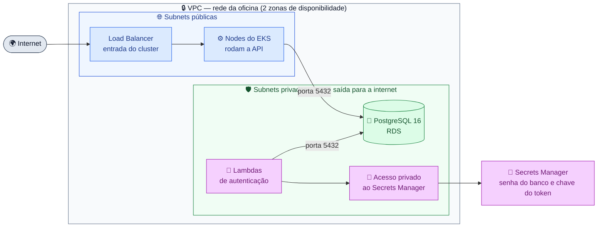
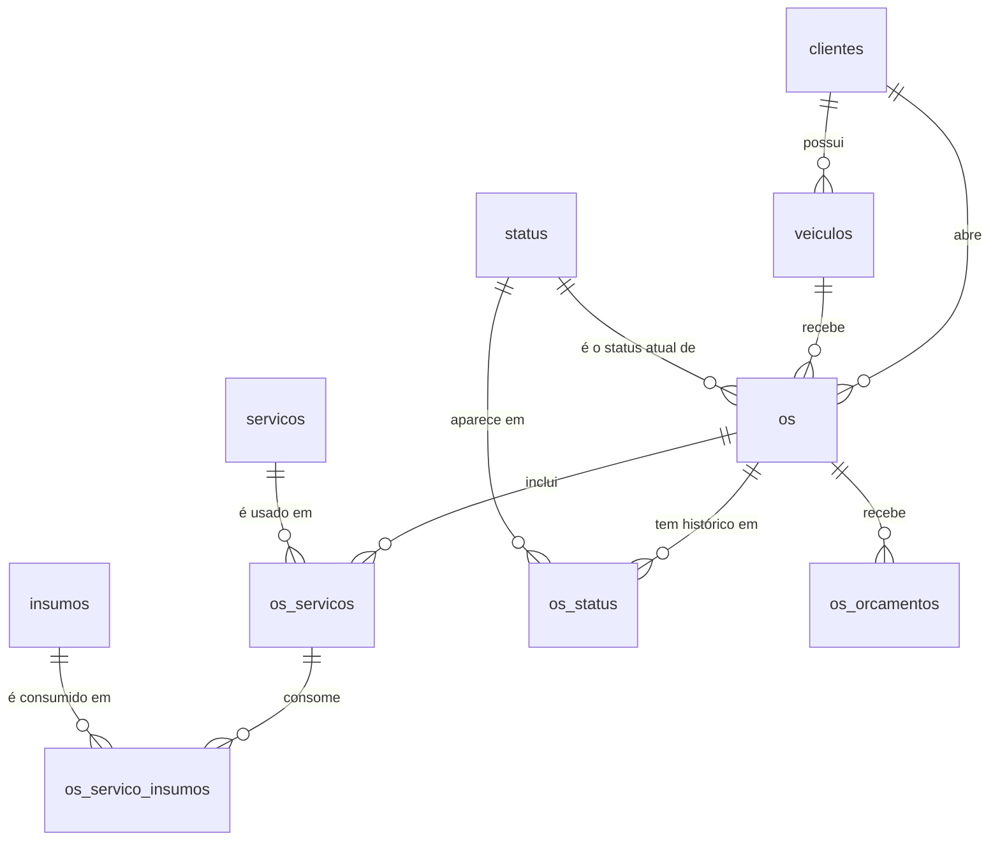

# oficina-infra-db

Terraform do **banco de dados** da Oficina Mecânica
(Tech Challenge 13SOAT — Fase 3). Cria a rede (VPC) usada por todos os
repositórios, o banco **PostgreSQL no Amazon RDS** e o **Secrets Manager** com
as senhas.

## Links

| O quê | Link |
|---|---|
| 🚪 API em produção (API Gateway) | https://q7m1gn8vqi.execute-api.us-east-1.amazonaws.com |
| 🗂️ Diagrama ER e relacionamentos | [modelo-de-dados.md](https://github.com/Lorenalgm/oficina_mecanica/blob/main/docs/arquitetura/modelo-de-dados.md) |
| 📝 Por que PostgreSQL (RFC-002) | [RFC-002](https://github.com/Lorenalgm/oficina_mecanica/blob/main/docs/rfcs/RFC-002-banco-de-dados.md) |
| ⚙️ Código da API | [oficina_mecanica](https://github.com/Lorenalgm/oficina_mecanica) |
| 🔐 Autenticação | [oficina-auth-lambda](https://github.com/Lorenalgm/oficina-auth-lambda) |
| ☸️ Kubernetes | [oficina-infra-k8s](https://github.com/Lorenalgm/oficina-infra-k8s) |

> O banco fica em rede privada, sem acesso pela internet. Só a API e a Lambda
> de autenticação conseguem se conectar.

## Arquitetura



**Legenda:** 🟦 parte pública (API) · 🟩 banco · 🟪 autenticação e segredos

### Decisões de rede

- **Sem NAT Gateway.** Nada na parte privada precisa de internet. A Lambda
  acessa o Secrets Manager por um endpoint privado, bem mais barato. Isso
  importa porque o Learner Lab tem orçamento de USD 50.
- **O banco começa fechado.** O firewall (security group) do RDS nasce sem
  nenhuma regra de entrada. Cada repositório que precisa do banco libera o
  próprio acesso. Assim este repositório não depende dos outros.

## Por que PostgreSQL

Resumo da [RFC-002](https://github.com/Lorenalgm/oficina_mecanica/blob/main/docs/rfcs/RFC-002-banco-de-dados.md):

| Motivo | Exemplo no sistema |
|---|---|
| **Transações** | Aprovar um orçamento muda o status da OS, grava o histórico e baixa o estoque de todas as peças, tudo ou nada |
| **Chaves estrangeiras** | 10 tabelas ligadas; não é possível apagar um serviço que está em uso numa OS |
| **Consultas com agregação** | Tempo médio por status sai direto do histórico em SQL |
| **Valores exatos** | Preços em `decimal(10,2)`, sem erro de arredondamento |
| **Sem retrabalho** | A API já usava PostgreSQL na Fase 2 |

**Por que RDS e não o banco dentro do cluster:** backup automático, disco
criptografado, e os dados sobrevivem quando o cluster é destruído.

## Modelo de dados



Colunas, regras de exclusão e explicação de cada relacionamento:
[modelo-de-dados.md](https://github.com/Lorenalgm/oficina_mecanica/blob/main/docs/arquitetura/modelo-de-dados.md).

## Stack

| Item | Escolha |
|---|---|
| Infraestrutura como código | Terraform ≥ 1.5 |
| Banco | Amazon RDS PostgreSQL 16, `db.t3.micro`, 20 GB criptografado |
| Segredos | AWS Secrets Manager (`oficina/app`) |
| Rede | VPC `10.0.0.0/16`, 2 zonas, subnets públicas e privadas |
| Estado do Terraform | S3 com trava no DynamoDB |

## Validar localmente

```bash
cd terraform
terraform init -backend=false
terraform fmt -check -recursive
terraform validate
```

## Deploy

Pré-requisito: bucket S3 e tabela DynamoDB para o estado do Terraform.

```bash
cd terraform
terraform init \
  -backend-config="bucket=<bucket do state>" \
  -backend-config="region=us-east-1" \
  -backend-config="dynamodb_table=<tabela de trava>"

terraform apply                 # cerca de 10 minutos
terraform output db_endpoint
```

**No AWS Academy:** as credenciais mudam a cada sessão de 4 horas. O RDS
continua cobrando entre sessões, então pause quando não estiver usando:

```bash
aws rds stop-db-instance  --db-instance-identifier oficina-db   # pausa por até 7 dias
aws rds start-db-instance --db-instance-identifier oficina-db
```

## CI/CD

| Workflow | Quando roda | O que faz |
|---|---|---|
| `ci.yml` | pull request | Valida o Terraform |
| `cd.yml` | push em `main` ou `develop` | Aplica o Terraform na AWS |

- `main` = produção, `develop` = homologação. A `main` só recebe código por pull request.
- Secrets: `AWS_ACCESS_KEY_ID`, `AWS_SECRET_ACCESS_KEY`, `AWS_SESSION_TOKEN`,
  `TFSTATE_BUCKET`, `TFSTATE_LOCK_TABLE`.
