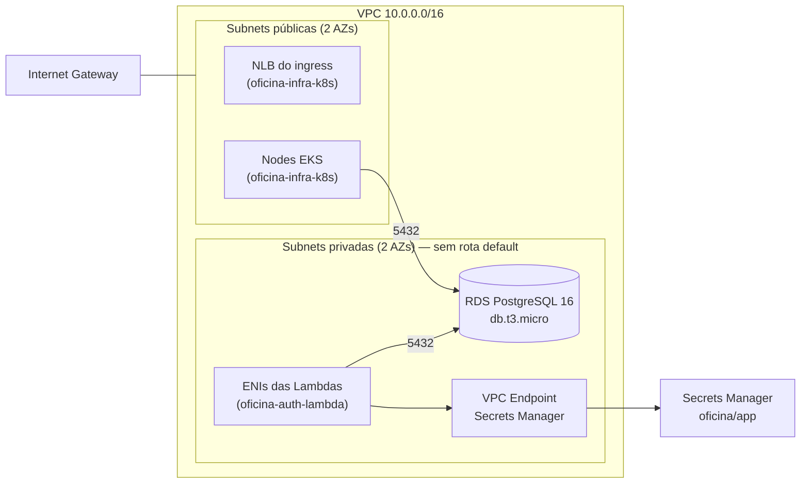
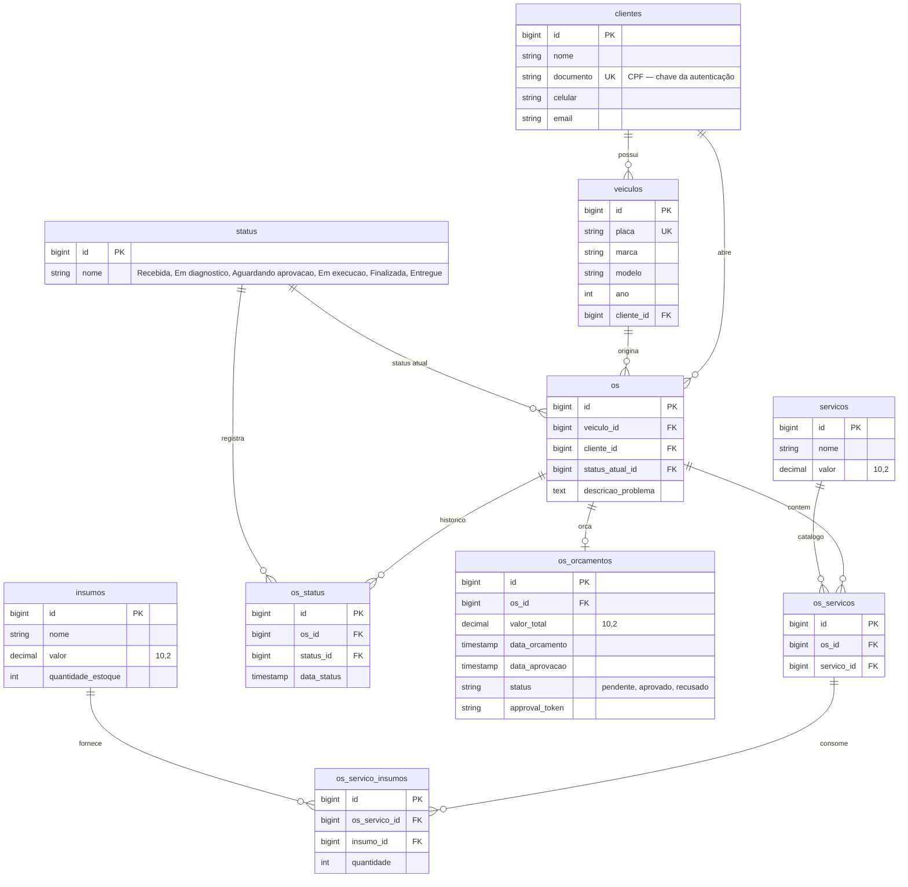

# oficina-infra-db

Infraestrutura como código do **banco de dados gerenciado** da Oficina Mecânica
(Tech Challenge 13SOAT — Fase 3). Provisiona a VPC compartilhada pelos demais
repositórios, a instância **Amazon RDS PostgreSQL** e o segredo no **AWS Secrets
Manager** consumido pela API e pela Lambda de autenticação.

## Tecnologias

| Item | Escolha |
|---|---|
| IaC | Terraform >= 1.5, provider AWS ~> 5.0 |
| Banco | Amazon RDS PostgreSQL 16, `db.t3.micro`, 20 GB gp3 criptografado |
| Segredos | AWS Secrets Manager (credenciais do banco + `JWT_SECRET`) |
| Rede | VPC 10.0.0.0/16, 2 AZs, subnets públicas e privadas, sem NAT Gateway |
| State | Backend S3 com lock em DynamoDB |
| CI/CD | GitHub Actions (`fmt`/`validate` no PR, `apply` no push) |

## Arquitetura



### Decisões de rede

**Sem NAT Gateway.** Nada nas subnets privadas precisa de internet: o RDS é
interno e a Lambda só fala com o banco e com o Secrets Manager. O acesso ao
Secrets Manager sai por um **VPC endpoint de interface**, que custa uma fração
do NAT. Isso importa porque o AWS Academy Learner Lab não interrompe NAT nem
Load Balancer entre sessões — eles continuariam consumindo o orçamento de USD 50.

**O security group do banco nasce sem `ingress`.** Cada consumidor cria a própria
regra a partir do seu repositório, apontando para o `db_sg_id` publicado nos
outputs. Assim o state deste repo não depende dos outros e não há ciclo.

## Justificativa formal do banco de dados

O domínio é **fortemente relacional e transacional**. Uma ordem de serviço amarra
cliente, veículo, catálogo de serviços, insumos com estoque, histórico de status e
orçamento — e a operação central (aprovar um orçamento) precisa, no mesmo átomo,
mudar o status da OS e **debitar o estoque de todos os insumos envolvidos**. Uma
falha parcial aí produziria estoque incorreto, que é um erro contábil, não um erro
de exibição.

Por isso a escolha é um banco **relacional com ACID**, e não um documental:

- **Integridade referencial declarada no banco.** Todas as 8 tabelas de negócio se
  ligam por chave estrangeira, com `ON DELETE CASCADE` onde a composição é real
  (`os_servicos` e `os_status` não existem sem a `os`) e restrito onde não é
  (não se apaga um `servico` do catálogo que esteja em uso). Em um banco
  documental essa garantia viraria código de aplicação.
- **Transações multi-tabela.** `AprovarOrcamento` atualiza `os_orcamentos`,
  insere em `os_status`, atualiza `os.status_atual_id` e decrementa
  `insumos.quantidade_estoque`. É uma transação ACID de livro.
- **Agregações analíticas.** O requisito de "tempo médio de execução por status"
  é uma janela sobre `os_status` (`LAG` / diferença entre timestamps
  consecutivos) — trivial em SQL, custosa fora dele.
- **Volume modesto e schema estável.** Dezenas de milhares de OS por ano, com
  modelo conhecido. Não há pressão de escala horizontal que justifique abrir mão
  de junções.

**Por que PostgreSQL** entre os relacionais: é o que a aplicação já usava em
container na Fase 2 (migração sem reescrever nada), tem tipos `numeric` exatos
para valores monetários — `decimal(10,2)` em `servicos.valor`, `insumos.valor` e
`os_orcamentos.valor_total`, onde ponto flutuante seria inaceitável —, funções de
janela maduras para as métricas, e está no free tier do RDS em `db.t3.micro`.

**Por que gerenciado (RDS) e não um StatefulSet:** backup automático, storage
criptografado, patching e a separação entre o ciclo de vida do dado e o do
cluster. Na Fase 2 o Postgres vivia dentro do kind e morria junto com ele.

### Modelo de dados



**Relacionamentos que merecem explicação:**

- **`os.status_atual_id` convive com `os_status`.** A tabela `os_status` é o
  histórico append-only (é dela que sai o tempo médio por status); a coluna em
  `os` é a desnormalização deliberada do último registro, para que a listagem de
  OS não precise de subconsulta correlacionada a cada linha.
- **`os → os_servicos → os_servico_insumos` é uma cadeia, não duas N:N.** O
  insumo é consumido por um *serviço dentro daquela OS*, não pela OS. Trocar um
  serviço devolve exatamente os insumos dele.
- **`os_orcamentos.approval_token`** permite ao cliente aprovar ou recusar por um
  link sem autenticar — por isso é único e descartável, e não deriva do id.
- **`clientes.documento` é `UNIQUE`** porque é a chave de entrada da Lambda de
  autenticação: o CPF precisa resolver para no máximo um cliente.

## Execução local

```bash
cd terraform
terraform init -backend=false      # validação sem tocar na AWS
terraform fmt -check -recursive
terraform validate
```

## Deploy

Pré-requisitos: bucket S3 e tabela DynamoDB de lock já existentes (criados uma
única vez, fora do Terraform).

```bash
export BUCKET=oficina-tfstate-<sufixo>
export LOCK=oficina-tfstate-lock

cd terraform
terraform init \
  -backend-config="bucket=$BUCKET" \
  -backend-config="region=us-east-1" \
  -backend-config="dynamodb_table=$LOCK"

terraform apply
```

O `apply` leva ~10 minutos (a criação do RDS domina). Ao final:

```bash
terraform output db_endpoint
terraform output secret_arn
aws secretsmanager get-secret-value --secret-id oficina/app --query SecretString --output text | jq .
```

### AWS Academy Learner Lab

As credenciais são temporárias e trocam a cada sessão de 4 horas. Antes de rodar
qualquer `terraform`, cole o bloco de **AWS Details → AWS CLI → Show** em
`~/.aws/credentials` (inclui `aws_session_token`). Para o GitHub Actions, os três
secrets `AWS_ACCESS_KEY_ID`, `AWS_SECRET_ACCESS_KEY` e `AWS_SESSION_TOKEN`
precisam ser atualizados na mesma frequência.

O Learner Lab **não interrompe o RDS entre sessões** — ele continua cobrando.
Enquanto não estiver usando:

```bash
aws rds stop-db-instance --db-instance-identifier oficina-db   # pausa por até 7 dias
aws rds start-db-instance --db-instance-identifier oficina-db
```

## CI/CD

| Workflow | Gatilho | O que faz |
|---|---|---|
| `ci.yml` | pull request | `fmt -check`, `init -backend=false`, `validate` |
| `cd.yml` | push em `main` / `develop` | `init` com backend remoto e `apply -auto-approve` |

`main` = produção, `develop` = homologação. A branch `main` é protegida: sem
commit direto, PR obrigatório e o job de CI como status check exigido.

## Repositórios relacionados

| Repo | Papel |
|---|---|
| [`oficina-api`](../oficina-api) | Aplicação Laravel em Kubernetes |
| [`oficina-auth-lambda`](../oficina-auth-lambda) | API Gateway + Lambdas de autenticação por CPF |
| [`oficina-infra-k8s`](../oficina-infra-k8s) | EKS, ingress e agente do New Relic |
| `oficina-infra-db` | **este repositório** |
